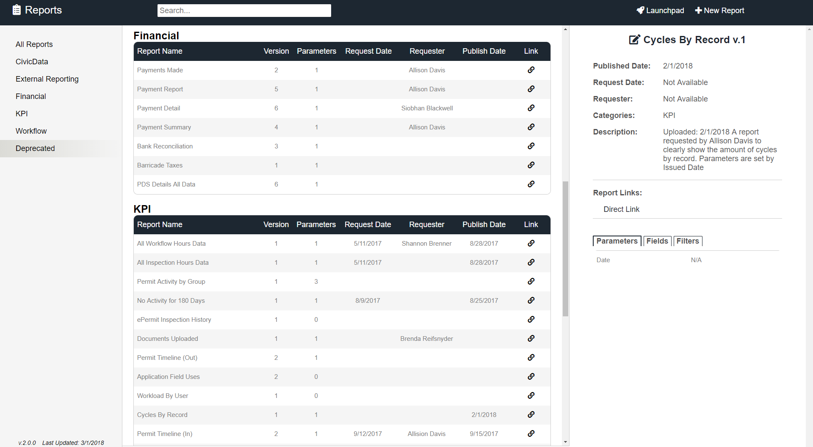

# Reports

Reports is a simple node.js web application to view our departments repository of custom reports developed for the Accela Civic Platform by the iTeam. We found this app was necessary because we were constantly This app connects to a MySQL database of reports published to the Accela Civic Platform report server that is available to staff to run at anytime.



## Installation

The Reports app requires a MySQL database to be installed and configured based on the table schema identified in the schema file [here](./reportSchema.sql). You can also see an example of what our database table looks like [here](.reportDatabaseExample.png). This also requires a few server-side node packages to be installed for the app to function properly:
-fs (for file I/O)
-mysql (for database connections)
-diet (for running multiple node applications on the same server)
-diet-static (for serving static file folder to applications)
-socket.io (for event handling from client/server)

Once all the necessary packages are installed, you need to properly define your configurations file. This is a simple JSON object containing the pertinent information for your application instance. This includes things like the url, database name, etc. You can find the template configuration file [here](./template-config.json).

## Usage

Once node is installed and your config file is setup, run the command below to startup the application.

```bash
node path/to/server/file.js path/to/config/file.json
```

Then in your browser, navigate to the url you provided in the config file to connect to Tracker.

## Support

Our team is always happy to help answer any questions you may have about our applications. Please email us at tacomapermits@cityoftacoma.org and we will try to help.

## Authors

The Reports app was built by the City of Tacoma Planning & Development Services Innovation Team (iTeam). The following iTeam members have contributed to the development of Tracker:
- Casey Jamrog
- Nathan Connors

## Acknowledgements

We would like to thank [FontAwesome](https://fontawesome.com/) for providing the icons used in several of our applications. 

## License

The Report app is licensed under [MIT](https://opensource.org/licenses/MIT).